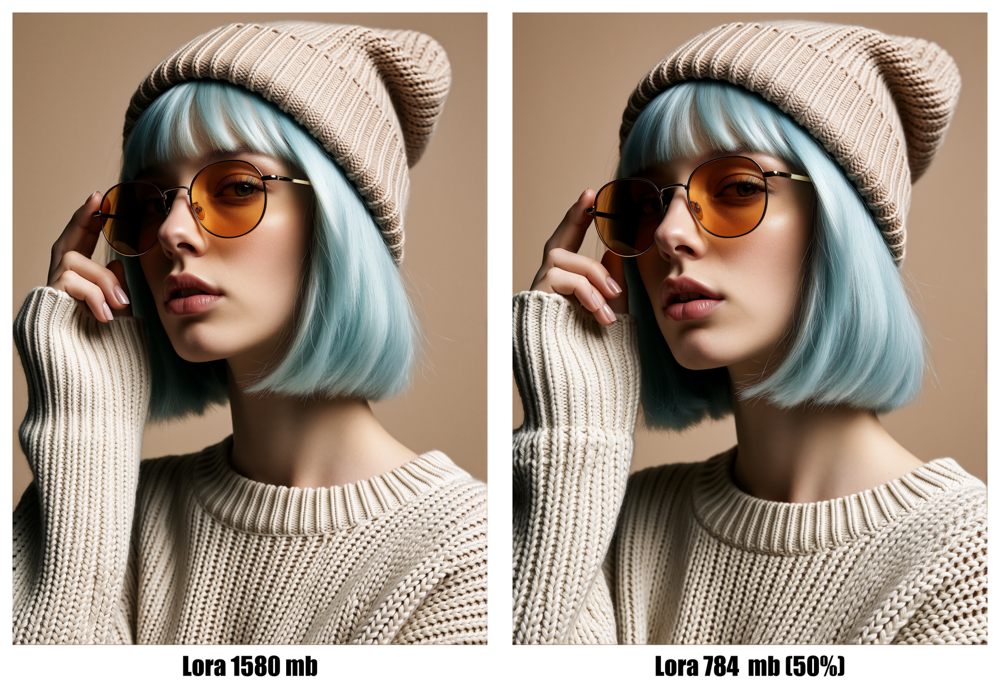
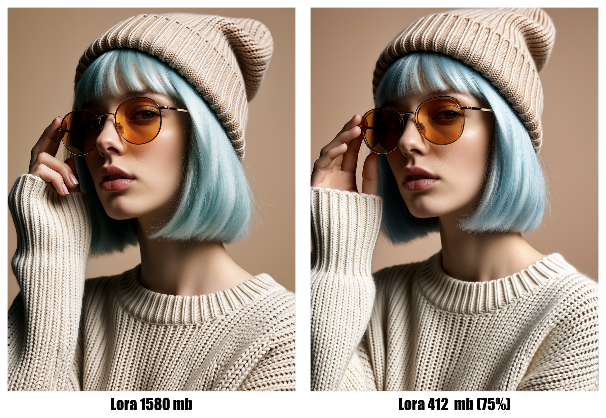
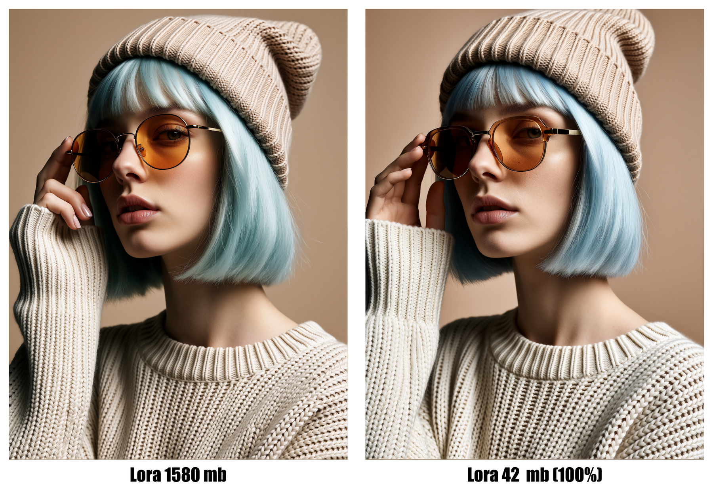

<div align="center">

# ✂️ Krea2 LoRA Compressor

### Безопасное уменьшение Krea2 LoRA с выбором уровня сжатия

**Оригинальная LoRA не изменяется и не перезаписывается.**


</div>

---

## О проекте

**Krea2 LoRA Compressor** создаёт облегчённые версии Krea2 LoRA/LoKr в формате `.safetensors`. Программа удаляет целые transformer-блоки `diffusion_model.blocks.N.*`, начиная с краёв архитектуры, и сохраняет важные text-conditioning слои `diffusion_model.txtfusion.*`.

Подходит для экспериментов со style/character LoRA, когда требуется уменьшить размер файла и потребление памяти. Итоговое качество зависит от конкретной модели — сравнивайте версии при одинаковых prompt, seed и настройках генерации.

> [!IMPORTANT]
> Выбранный процент означает долю удаляемых **transformer-блоков**, а не точный процент уменьшения размера файла.

## Возможности

- 🛡️ оригинальный `.safetensors` открывается только для чтения;
- 🧱 удаляются целые блоки, без повреждения блока частичным удалением тензоров;
- ↔️ блоки удаляются от краёв к центру: сначала `0–5` и `23–27`;
- 🎚️ пять уровней: **5%, 25%, 50%, 75%, 95%**;
- 📝 понятные имена выходных версий с процентом и профилем качества;
- 🌐 12 языков интерфейса;
- 🌑 тёмная тема Windows GUI;
- 📊 индикатор выполнения и подробный отчёт;
- ⚙️ асинхронная обработка — окно не зависает во время сохранения;
- 🧬 автоматическая проверка Krea2 по сигнатуре `diffusion_model.txtfusion.`;
- 📁 обработка одного файла через GUI или целой папки через CLI;
- 🚫 существующий результат не перезаписывается;
- 🧾 metadata SafeTensors сохраняется;
- 🔒 Lokr factor не изменяется.

## Быстрый запуск

### 1. Установите Python

Нужен **Python 3.9 или новее**. При установке Python включите опцию **Add Python to PATH**. [https://www.python.org](https://www.python.org)

### 2. Установите зависимости

Откройте терминал в папке проекта и выполните:

```bat
python -m pip install -r requirements.txt
```

### 3. Запустите приложение

Дважды нажмите:

```text
RUN.bat
```

Далее:

1. выберите Krea2 LoRA в формате `.safetensors`;
2. выберите уровень сжатия;
3. проверьте автоматически сформированное имя результата;
4. нажмите **Compress model / Сжать модель**;
5. дождитесь сообщения об успешном завершении.

Результат появится рядом с исходной LoRA. Оригинал останется без изменений.

## Уровни сжатия

Для стандартной архитектуры из 28 transformer-блоков:

| Уровень | Удаляется блоков | Имя выходной версии                                | Рекомендация                         |
|:-------:|:----------------:| -------------------------------------------------- | ------------------------------------ |
| **5%**  | 2 из 28          | `*_stripped_5pct_near_original.safetensors`        | почти исходное качество              |
| **25%** | 7 из 28          | `*_stripped_25pct_high_quality.safetensors`        | высокое качество, заметная экономия  |
| **50%** | 14 из 28         | `*_stripped_50pct_balanced.safetensors`            | баланс размера и качества            |
| **75%** | 21 из 28         | `*_stripped_75pct_compact.safetensors`             | компактный файл, выше риск изменений |
| **95%** | 27 из 28         | `*_stripped_95pct_maximum_compression.safetensors` | максимальное сжатие, наибольший риск |

> [!WARNING]
> 75% и особенно 95% могут заметно изменить детали, композицию или стабильность LoRA. Всегда проводите A/B-сравнение.

## Сравнения

Все изображения получены при сопоставимых условиях генерации и показывают исходную LoRA рядом со сжатой версией.

### 50% — Balanced

Исходная LoRA **1580 MB** и версия **784 MB**.



### 75% — Compact

Исходная LoRA **1580 MB** и версия **412 MB**.



### Максимальное сжатие — 95%



> Встроенная подпись `100%` на этом историческом изображении относится к предыдущему названию максимального пресета. В актуальной версии приложения максимальный уровень заменён на **95%** и сохраняет один transformer-блок.

## Поддерживаемые языки

По умолчанию используется English. Доступны:

`English` · `Русский` · `Español` · `Français` · `Deutsch` · `Português` · `中文` · `日本語` · `한국어` · `العربية` · `हिन्दी` · `Italiano`

## Использование из командной строки

### Один файл

```bat
python batch_strip_krea2.py --file "D:\LoRA\model.safetensors" --percentage 50
```

### Все Krea2 LoRA в папке

```bat
python batch_strip_krea2.py --folder "D:\LoRA\Krea2" --percentage 25
```

### Предварительная проверка без записи

```bat
python batch_strip_krea2.py --file "D:\LoRA\model.safetensors" --percentage 95 --dry-run
```

Допустимые значения `--percentage`: `5`, `25`, `50`, `75`, `95`.

## Как это работает

Типичная Krea2 LoRA содержит две основные группы:

```text
diffusion_model.blocks.N.*      # transformer-блоки — основная часть размера
diffusion_model.txtfusion.*     # text-conditioning — сохраняется
```

Алгоритм:

1. проверяет наличие Krea2-сигнатуры `diffusion_model.txtfusion.`;
2. определяет доступные номера transformer-блоков;
3. вычисляет количество целых блоков для выбранного уровня;
4. формирует приоритет удаления от краёв к центру;
5. сохраняет оставшиеся тензоры и исходную metadata в новый файл;
6. проверяет фактическое наличие выходного файла и показывает отчёт.

## Безопасность файлов

- исходная LoRA не удаляется;
- исходная LoRA не переименовывается;
- результат получает отдельное имя;
- существующая версия не перезаписывается;
- файлы других архитектур автоматически пропускаются;
- созданные ранее `*_stripped_*` не обрабатываются повторно.

Несмотря на эти меры, для важных моделей рекомендуется иметь резервную копию.

## Состав репозитория

```text
Krea2-LoRA-Compressor/
├── RUN.bat                  # запуск GUI
├── GUI_Compress.ps1         # тёмный многоязычный интерфейс
├── batch_strip_krea2.py     # ядро обработки SafeTensors
├── krea2_compressor.ico     # иконка приложения
├── requirements.txt         # зависимости Python
├── comparisons/             # интерфейс и визуальные сравнения
├── LICENSE
└── README.md
```

## Ограничения

- предназначено только для Krea2 LoRA/LoKr с `txtfusion`;
- процент блоков и процент уменьшения размера — разные величины;
- программа не измеряет визуальное качество автоматически;
- LoRA, обучающие новый объект, позу или сложную композицию, могут сильнее зависеть от transformer-блоков;
- результат следует проверять в реальном workflow перед удалением любых собственных резервных копий.

## Благодарности

Техника selective tensor stripping основана на подходе, опубликованном **Puppet_Master** для уменьшения Krea2 LoRA:

https://civitai.red/models/2742336/nsfw-krea2-low-vram?modelVersionId=3089248

---

Купить кофе разработчикам: ☕ ☕ ☕

Дайте мне знать, если у вас возникнут какие-либо проблемы и мы постараемся их исправить! Поддержать этот проект можно по ссылке: [❤️❤️❤️ D O N A T ❤️❤️❤️](https://boosty.to/stabledif)

**by StableDif & OreX**
