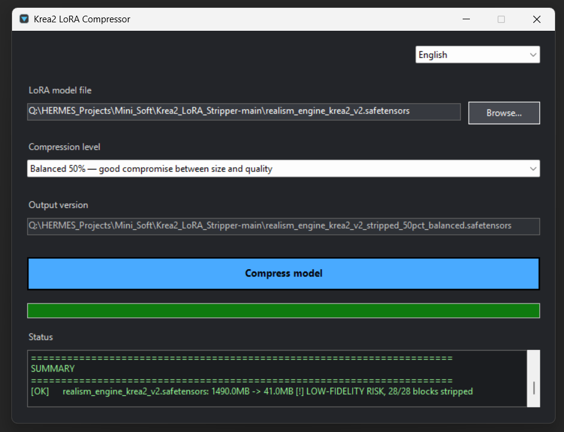
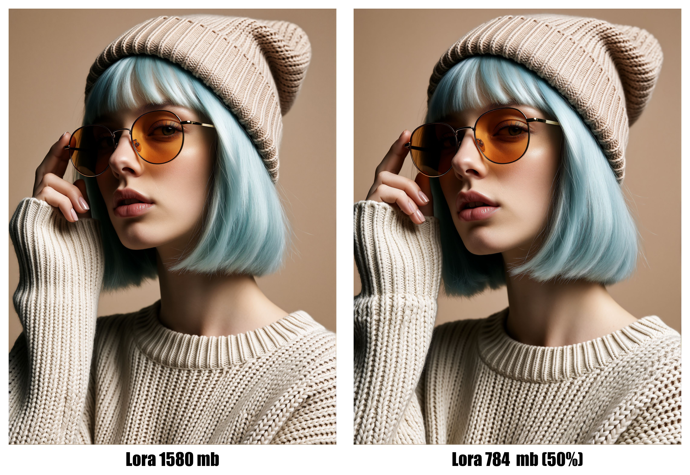
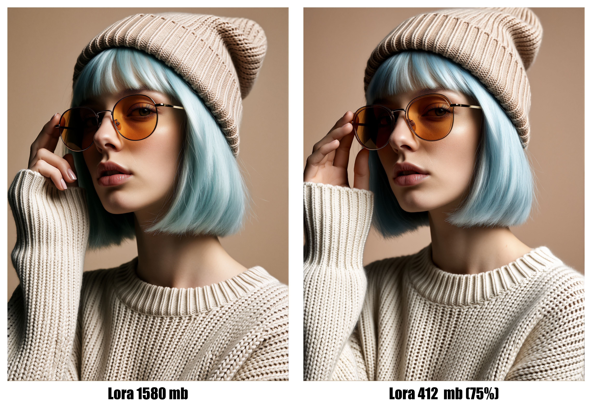

<p align="center">
  <a href="#english"><strong>English</strong></a> · <a href="#russian"><strong>Русский</strong></a>
</p>

<a id="english"></a>

<div align="center">

# ✂️ Krea2 LoRA Compressor

### Safely reduce Krea2 LoRA files with selectable compression levels

**The original LoRA is never modified or overwritten.**



</div>

---

## About

**Krea2 LoRA Compressor** creates lightweight versions of Krea2 LoRA/LoKr models in `.safetensors` format. It removes complete transformer blocks matching `diffusion_model.blocks.N.*`, starting from the edges of the architecture, while preserving the important text-conditioning layers under `diffusion_model.txtfusion.*`.

It is useful for experiments with style and character LoRAs when you need to reduce file size and memory usage. The resulting quality depends on the particular model, so compare versions using identical prompts, seeds, and generation settings.

> [!IMPORTANT]
> The selected percentage represents the proportion of **transformer blocks removed**, not the exact percentage by which the file size will decrease.

## Features

- 🛡️ the original `.safetensors` file is opened read-only;
- 🧱 complete blocks are removed, avoiding block corruption caused by partial tensor removal;
- ↔️ blocks are removed from the edges toward the center: ranges `0–5` and `23–27` are prioritized;
- 🎚️ five compression levels: **5%, 25%, 50%, 75%, and 95%**;
- 📝 clear output filenames containing the percentage and quality profile;
- 🌐 interface available in 12 languages;
- 🌑 dark-themed Windows GUI;
- 📊 progress indicator and detailed completion report;
- ⚙️ asynchronous processing keeps the window responsive while saving;
- 🧬 automatic Krea2 validation using the `diffusion_model.txtfusion.` signature;
- 📁 process one file through the GUI or an entire folder through the CLI;
- 🚫 existing output files are never overwritten;
- 🧾 SafeTensors metadata is preserved;
- 🔒 the LoKr factor is not changed.

## Quick Start

### Option 1 — Portable build (recommended)

You do not need to install Python or additional packages. Everything required is already included in the archive.

<h2 align="center">
  <a href="https://github.com/orex2121/Krea2LoRACompressor/releases/download/1.0.1/Krea2-LoRA-Compressor-Portable_v1.0.1.7z">⬇️ DOWNLOAD PORTABLE</a>
</h2>

1. Download `Krea2-LoRA-Compressor-Portable_v1.0.1.7z` using the link above.
2. Fully extract the archive to any convenient folder.
3. Open the extracted folder and double-click `RUN.bat`.

> [!IMPORTANT]
> Do not run the application directly from the archive. Extract it completely first.

### Option 2 — Install with Python

#### 1. Install Python

You need **Python 3.9 or newer**. Enable **Add Python to PATH** during installation. [https://www.python.org](https://www.python.org)

#### 2. Install dependencies

Open a terminal in the project folder and run:

```bat
python -m pip install -r requirements.txt
```

#### 3. Launch the application

Double-click:

```text
RUN.bat
```

### Using the application

1. select a Krea2 LoRA file in `.safetensors` format;
2. select a compression level;
3. check the automatically generated output filename;
4. click **Compress model / Сжать модель**;
5. wait for the success message.

The resulting file will be created next to the original LoRA. The original will remain unchanged.

## Compression Levels

For the standard architecture containing 28 transformer blocks:

| Level   | Blocks removed | Output filename                                    | Recommendation                              |
|:-------:|:--------------:| -------------------------------------------------- | ------------------------------------------- |
| **5%**  | 2 of 28        | `*_stripped_5pct_near_original.safetensors`        | nearly original quality                     |
| **25%** | 7 of 28        | `*_stripped_25pct_high_quality.safetensors`        | high quality with noticeable size reduction |
| **50%** | 14 of 28       | `*_stripped_50pct_balanced.safetensors`            | balanced size and quality                   |
| **75%** | 21 of 28       | `*_stripped_75pct_compact.safetensors`             | compact file with a higher risk of changes  |
| **95%** | 27 of 28       | `*_stripped_95pct_maximum_compression.safetensors` | maximum compression and highest risk        |

> [!WARNING]
> 75%, and especially 95%, may noticeably alter LoRA details, composition, or stability. Always perform an A/B comparison.

## Comparisons

All images were produced under comparable generation conditions and show the original LoRA next to its compressed version.

### 50% — Balanced

Original LoRA: **1580 MB**. Compressed version: **784 MB**.



### 75% — Compact

Original LoRA: **1580 MB**. Compressed version: **412 MB**.



### Maximum compression — 95%


> The `100%` label embedded in this historical image refers to the previous name of the maximum preset. In the current application, the maximum level has been changed to **95%** and preserves one transformer block.

## Supported Languages

English is selected by default. Available languages:

`English` · `Русский` · `Español` · `Français` · `Deutsch` · `Português` · `中文` · `日本語` · `한국어` · `العربية` · `हिन्दी` · `Italiano`

## Command-Line Usage

### One file

```bat
python batch_strip_krea2.py --file "D:\LoRA\model.safetensors" --percentage 50
```

### All Krea2 LoRA files in a folder

```bat
python batch_strip_krea2.py --folder "D:\LoRA\Krea2" --percentage 25
```

### Preview without writing an output file

```bat
python batch_strip_krea2.py --file "D:\LoRA\model.safetensors" --percentage 95 --dry-run
```

Accepted `--percentage` values: `5`, `25`, `50`, `75`, and `95`.

## How It Works

A typical Krea2 LoRA contains two main groups:

```text
diffusion_model.blocks.N.*      # transformer blocks — most of the file size
diffusion_model.txtfusion.*     # text-conditioning layers — preserved
```

The algorithm:

1. checks for the Krea2 signature `diffusion_model.txtfusion.`;
2. detects the available transformer block numbers;
3. calculates how many complete blocks correspond to the selected level;
4. builds a removal priority from the edges toward the center;
5. saves the remaining tensors and original metadata to a new file;
6. verifies that the output file was actually created and displays a report.

## File Safety

- the original LoRA is not deleted;
- the original LoRA is not renamed;
- the result receives a separate filename;
- an existing result is not overwritten;
- files using other architectures are skipped automatically;
- previously created `*_stripped_*` files are not processed again.

Despite these safeguards, keeping a backup of important models is recommended.

## Repository Contents

```text
Krea2-LoRA-Compressor/
├── RUN.bat                  # launches the GUI
├── GUI_Compress.ps1         # dark multilingual interface
├── batch_strip_krea2.py     # SafeTensors processing core
├── krea2_compressor.ico     # application icon
├── requirements.txt         # Python dependencies
├── comparisons/             # interface and visual comparisons
├── LICENSE
└── README.md
```

## Limitations

- intended only for Krea2 LoRA/LoKr models containing `txtfusion`;
- the percentage of removed blocks and the percentage of file-size reduction are not the same;
- the application does not evaluate visual quality automatically;
- LoRAs trained on a new object, pose, or complex composition may depend more heavily on transformer blocks;
- test the result in a real workflow before deleting any of your own backups.

## Credits

The selective tensor stripping technique is based on an approach published by **Puppet_Master** for reducing Krea2 LoRA files: [ССЫЛКА](https://civitai.red/models/2742336/nsfw-krea2-low-vram?modelVersionId=3089248)

---

Buy the developers a coffee: ☕ ☕ ☕

Let us know if you encounter any problems and we will do our best to fix them. You can support this project here: [❤️❤️❤️ D O N A T ❤️❤️❤️](https://boosty.to/stabledif)

**by StableDif & OreX**

<a id="russian"></a>

---

<div align="center">

## Русская версия

</div>

<div align="center">

# ✂️ Krea2 LoRA Compressor

### Безопасное уменьшение Krea2 LoRA с выбором уровня сжатия

**Оригинальная LoRA не изменяется и не перезаписывается.**


</div>

---

## О проекте

**Krea2 LoRA Compressor** создаёт облегчённые версии Krea2 LoRA/LoKr в формате `.safetensors`. Программа удаляет целые transformer-блоки `diffusion_model.blocks.N.*`, начиная с краёв архитектуры, и сохраняет важные text-conditioning слои `diffusion_model.txtfusion.*`.

Подходит для экспериментов со style/character LoRA, когда требуется уменьшить размер файла и потребление памяти. Итоговое качество зависит от конкретной модели — сравнивайте версии при одинаковых prompt, seed и настройках генерации.

> [!IMPORTANT]
> Выбранный процент означает долю удаляемых **transformer-блоков**, а не точный процент уменьшения размера файла.

## Возможности

- 🛡️ оригинальный `.safetensors` открывается только для чтения;
- 🧱 удаляются целые блоки, без повреждения блока частичным удалением тензоров;
- ↔️ блоки удаляются от краёв к центру: сначала `0–5` и `23–27`;
- 🎚️ пять уровней: **5%, 25%, 50%, 75%, 95%**;
- 📝 понятные имена выходных версий с процентом и профилем качества;
- 🌐 12 языков интерфейса;
- 🌑 тёмная тема Windows GUI;
- 📊 индикатор выполнения и подробный отчёт;
- ⚙️ асинхронная обработка — окно не зависает во время сохранения;
- 🧬 автоматическая проверка Krea2 по сигнатуре `diffusion_model.txtfusion.`;
- 📁 обработка одного файла через GUI или целой папки через CLI;
- 🚫 существующий результат не перезаписывается;
- 🧾 metadata SafeTensors сохраняется;
- 🔒 Lokr factor не изменяется.

## Быстрый запуск

### Вариант 1 — Portable-сборка (рекомендуется)

Python и дополнительные пакеты устанавливать не нужно — всё необходимое уже включено в архив.

<h2 align="center">
  <a href="https://github.com/orex2121/Krea2LoRACompressor/releases/download/1.0.1/Krea2-LoRA-Compressor-Portable_v1.0.1.7z">⬇️ DOWNLOAD PORTABLE</a>
</h2>

1. Скачайте архив `Krea2-LoRA-Compressor-Portable_v1.0.1.7z` по ссылке выше.
2. Полностью распакуйте архив в любую удобную папку.
3. Откройте распакованную папку и дважды нажмите `RUN.bat`.

> [!IMPORTANT]
> Не запускайте приложение непосредственно из архива — сначала полностью распакуйте его.

### Вариант 2 — Установка с Python

#### 1. Установите Python

Нужен **Python 3.9 или новее**. При установке Python включите опцию **Add Python to PATH**. [https://www.python.org](https://www.python.org)

#### 2. Установите зависимости

Откройте терминал в папке проекта и выполните:

```bat
python -m pip install -r requirements.txt
```

#### 3. Запустите приложение

Дважды нажмите:

```text
RUN.bat
```

### Работа с приложением

1. выберите Krea2 LoRA в формате `.safetensors`;
2. выберите уровень сжатия;
3. проверьте автоматически сформированное имя результата;
4. нажмите **Compress model / Сжать модель**;
5. дождитесь сообщения об успешном завершении.

Результат появится рядом с исходной LoRA. Оригинал останется без изменений.

## Уровни сжатия

Для стандартной архитектуры из 28 transformer-блоков:

| Уровень | Удаляется блоков | Имя выходной версии                                | Рекомендация                         |
|:-------:|:----------------:| -------------------------------------------------- | ------------------------------------ |
| **5%**  | 2 из 28          | `*_stripped_5pct_near_original.safetensors`        | почти исходное качество              |
| **25%** | 7 из 28          | `*_stripped_25pct_high_quality.safetensors`        | высокое качество, заметная экономия  |
| **50%** | 14 из 28         | `*_stripped_50pct_balanced.safetensors`            | баланс размера и качества            |
| **75%** | 21 из 28         | `*_stripped_75pct_compact.safetensors`             | компактный файл, выше риск изменений |
| **95%** | 27 из 28         | `*_stripped_95pct_maximum_compression.safetensors` | максимальное сжатие, наибольший риск |

> [!WARNING]
> 75% и особенно 95% могут заметно изменить детали, композицию или стабильность LoRA. Всегда проводите A/B-сравнение.

## Сравнения

Все изображения получены при сопоставимых условиях генерации и показывают исходную LoRA рядом со сжатой версией.

### 50% — Balanced

Исходная LoRA **1580 MB** и версия **784 MB**.


### 75% — Compact

Исходная LoRA **1580 MB** и версия **412 MB**.


### Максимальное сжатие — 95%


> Встроенная подпись `100%` на этом историческом изображении относится к предыдущему названию максимального пресета. В актуальной версии приложения максимальный уровень заменён на **95%** и сохраняет один transformer-блок.

## Поддерживаемые языки

По умолчанию используется English. Доступны:

`English` · `Русский` · `Español` · `Français` · `Deutsch` · `Português` · `中文` · `日本語` · `한국어` · `العربية` · `हिन्दी` · `Italiano`

## Использование из командной строки

### Один файл

```bat
python batch_strip_krea2.py --file "D:\LoRA\model.safetensors" --percentage 50
```

### Все Krea2 LoRA в папке

```bat
python batch_strip_krea2.py --folder "D:\LoRA\Krea2" --percentage 25
```

### Предварительная проверка без записи

```bat
python batch_strip_krea2.py --file "D:\LoRA\model.safetensors" --percentage 95 --dry-run
```

Допустимые значения `--percentage`: `5`, `25`, `50`, `75`, `95`.

## Как это работает

Типичная Krea2 LoRA содержит две основные группы:

```text
diffusion_model.blocks.N.*      # transformer-блоки — основная часть размера
diffusion_model.txtfusion.*     # text-conditioning — сохраняется
```

Алгоритм:

1. проверяет наличие Krea2-сигнатуры `diffusion_model.txtfusion.`;
2. определяет доступные номера transformer-блоков;
3. вычисляет количество целых блоков для выбранного уровня;
4. формирует приоритет удаления от краёв к центру;
5. сохраняет оставшиеся тензоры и исходную metadata в новый файл;
6. проверяет фактическое наличие выходного файла и показывает отчёт.

## Безопасность файлов

- исходная LoRA не удаляется;
- исходная LoRA не переименовывается;
- результат получает отдельное имя;
- существующая версия не перезаписывается;
- файлы других архитектур автоматически пропускаются;
- созданные ранее `*_stripped_*` не обрабатываются повторно.

Несмотря на эти меры, для важных моделей рекомендуется иметь резервную копию.

## Состав репозитория

```text
Krea2-LoRA-Compressor/
├── RUN.bat                  # запуск GUI
├── GUI_Compress.ps1         # тёмный многоязычный интерфейс
├── batch_strip_krea2.py     # ядро обработки SafeTensors
├── krea2_compressor.ico     # иконка приложения
├── requirements.txt         # зависимости Python
├── comparisons/             # интерфейс и визуальные сравнения
├── LICENSE
└── README.md
```

## Ограничения

- предназначено только для Krea2 LoRA/LoKr с `txtfusion`;
- процент блоков и процент уменьшения размера — разные величины;
- программа не измеряет визуальное качество автоматически;
- LoRA, обучающие новый объект, позу или сложную композицию, могут сильнее зависеть от transformer-блоков;
- результат следует проверять в реальном workflow перед удалением любых собственных резервных копий.

## Благодарности

Техника selective tensor stripping основана на подходе, опубликованном **Puppet_Master** для уменьшения Krea2 LoRA: [ССЫЛКА](https://civitai.red/models/2742336/nsfw-krea2-low-vram?modelVersionId=3089248)

---

Купить кофе разработчикам: ☕ ☕ ☕

Дайте мне знать, если у вас возникнут какие-либо проблемы и мы постараемся их исправить! Поддержать этот проект можно по ссылке: [❤️❤️❤️ D O N A T ❤️❤️❤️](https://boosty.to/stabledif)

**by StableDif & OreX**
